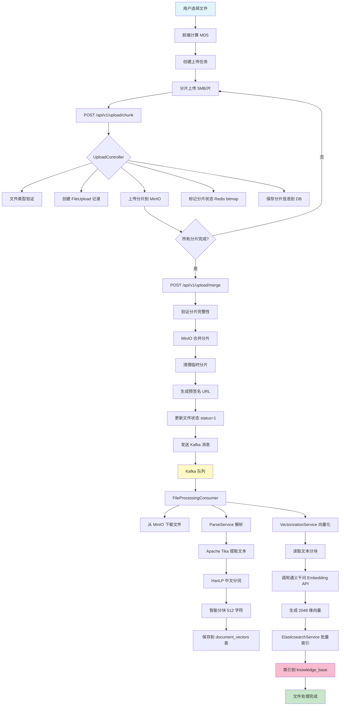
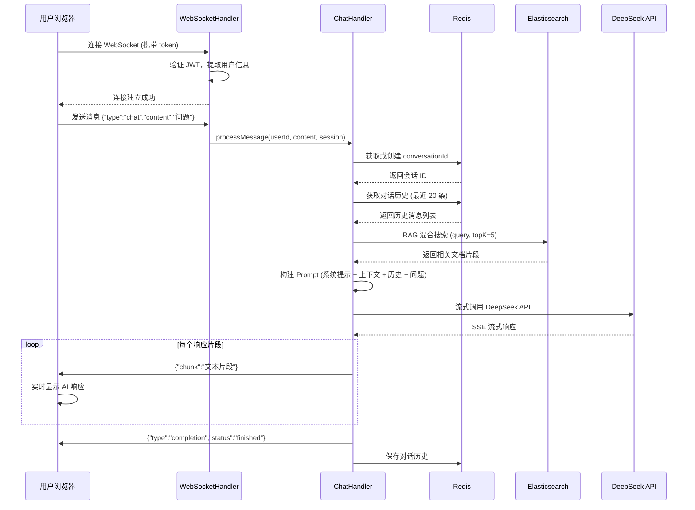
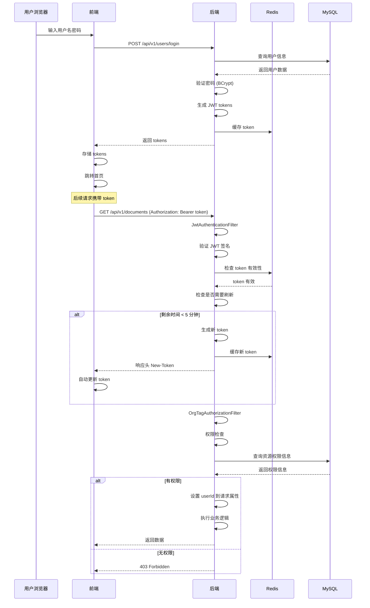

# PaiSmart 业务逻辑文档

> 本文档详细描述 PaiSmart AI 知识管理系统的核心业务逻辑、技术实现和数据流转流程。

## 目录

- [第一章：系统架构概述](#第一章系统架构概述)
- [第二章：文件上传与管理](#第二章文件上传与管理)
- [第三章：AI 聊天对话](#第三章ai-聊天对话)
- [第四章：用户认证与权限](#第四章用户认证与权限)
- [第五章：文档检索与搜索](#第五章文档检索与搜索)
- [第六章：系统配置与管理](#第六章系统配置与管理)

---

## 第一章：系统架构概述

### 1.1 技术栈总览

#### 前端技术栈
- **框架**: Vue 3.4+ (Composition API)
- **语言**: TypeScript 5.3+
- **包管理器**: pnpm 8.7.0+
- **UI 组件库**: Naive UI
- **路由**: @elegant/router
- **状态管理**: Pinia
- **样式**: UnoCSS + SCSS
- **HTTP 客户端**: Axios (@sa/axios)
- **实时通信**: WebSocket (@vueuse/core)

#### 后端技术栈
- **框架**: Spring Boot 3.x
- **语言**: Java 17
- **构建工具**: Maven 3.8.6+
- **数据库**: MySQL 8.0
- **ORM**: Spring Data JPA / Hibernate
- **安全**: Spring Security + JWT
- **缓存**: Redis 7.0.11
- **消息队列**: Kafka 3.2.1
- **文件存储**: MinIO 8.5.12
- **搜索引擎**: Elasticsearch 8.10.0
- **文档解析**: Apache Tika 2.9.1
- **中文分词**: HanLP 1.8.6

#### AI 服务集成
- **LLM 服务**: DeepSeek API (deepseek-chat)
- **向量化服务**: 阿里云通义千问 (text-embedding-v4)
- **向量维度**: 2048

### 1.2 整体架构

```
┌─────────────────────────────────────────────────────────────┐
│                         前端层 (Vue 3)                        │
│  ┌──────────┐  ┌──────────┐  ┌──────────┐  ┌──────────┐     │
│  │知识库管理│  │ AI 聊天  │  │用户管理  │  │系统配置  │     │
│  └──────────┘  └──────────┘  └──────────┘  └──────────┘     │
└─────────────────────────────────────────────────────────────┘
                            ↓ HTTP/WebSocket
┌─────────────────────────────────────────────────────────────┐
│                    应用层 (Spring Boot)                       │
│  ┌──────────┐  ┌──────────┐  ┌──────────┐  ┌──────────┐     │
│  │Controller│→│ Service  │→│ Repository│→│  Entity   │     │
│  └──────────┘  └──────────┘  └──────────┘  └──────────┘     │
│  ┌──────────┐  ┌──────────┐  ┌──────────┐                    │
│  │WebSocket │  │Security  │  │Exception │                    │
│  │ Handler  │  │ Filter   │  │ Handler  │                    │
│  └──────────┘  └──────────┘  └──────────┘                    │
└─────────────────────────────────────────────────────────────┘
                            ↓
┌─────────────────────────────────────────────────────────────┐
│                       中间件层                                │
│  ┌──────────┐  ┌──────────┐  ┌──────────┐  ┌──────────┐     │
│  │  Kafka   │  │  Redis   │  │ MinIO    │  │Elasticsearch│  │
│  └──────────┘  └──────────┘  └──────────┘  └──────────┘     │
└─────────────────────────────────────────────────────────────┘
                            ↓
┌─────────────────────────────────────────────────────────────┐
│                       数据存储层                              │
│  ┌──────────┐  ┌──────────┐  ┌──────────┐                   │
│  │  MySQL   │  │ MinIO    │  │Elasticsearch│                  │
│  │(关系数据)│  │(文件存储)│  │(向量搜索)  │                   │
│  └──────────┘  └──────────┘  └──────────┘                   │
└─────────────────────────────────────────────────────────────┘
                            ↓
┌─────────────────────────────────────────────────────────────┐
│                       外部服务层                              │
│  ┌──────────┐  ┌──────────┐                                 │
│  │DeepSeek  │  │通义千问  │                                 │
│  │(LLM)     │  │(Embedding)│                                │
│  └──────────┘  └──────────┘                                 │
└─────────────────────────────────────────────────────────────┘
```

### 1.3 核心服务依赖关系

| 服务 | 作用 | 被依赖方 |
|------|------|----------|
| **MySQL** | 存储用户、文件、组织标签等关系数据 | 所有业务服务 |
| **Redis** | 会话管理、Token 缓存、组织标签缓存 | 认证服务、聊天服务 |
| **MinIO** | 存储上传的原始文件 | 上传服务、文档服务 |
| **Elasticsearch** | 存储文档向量和全文检索 | 搜索服务、聊天服务 |
| **Kafka** | 异步文件处理消息队列 | 上传服务 → 文件处理消费者 |
| **DeepSeek** | 生成 AI 聊天回复 | 聊天服务 |
| **通义千问** | 文本向量化 | 向量化服务 |

---

## 第二章：文件上传与管理

### 2.1 前端上传组件

#### 主要组件文件
- **知识库主页面**: `frontend/src/views/knowledge-base/index.vue`
- **上传对话框**: `frontend/src/views/knowledge-base/modules/upload-dialog.vue`
- **状态管理**: `frontend/src/store/modules/knowledge-base/index.ts`

#### 上传表单字段
```typescript
interface UploadForm {
  orgTag: string;        // 组织标签（管理员用级联选择器，普通用户用下拉选择）
  isPublic: boolean;     // 是否公开（true=公开，false=私有）
  fileList: UploadFileInfo[];  // 文件列表（NUpload 组件）
}
```

#### 上传 UI 交互流程
1. 用户点击"上传文件"按钮 → 打开上传对话框
2. 选择组织标签（单选）
3. 设置公开/私有权限（单选按钮）
4. 选择文件（支持拖拽上传）
5. 点击"确定"开始上传
6. 实时显示上传进度
7. 上传完成后显示在文件列表

#### 文件类型限制
```typescript
// frontend/src/service/request/common.ts
uploadAccept = '.pdf,.doc,.docx,.txt'
```

### 2.2 分片上传机制

#### 前端分片策略
```typescript
// 关键配置
const CHUNK_SIZE = 5 * 1024 * 1024; // 5MB 每片
const MAX_CONCURRENT_UPLOADS = 3;    // 最多同时上传 3 个文件
```

#### MD5 去重机制
```typescript
// 前端计算文件 MD5
async function calculateMD5(file: File): Promise<string> {
  // 使用 spark-md5 库计算文件 MD5
  // 用于文件去重和断点续传
}
```

#### 上传任务管理
```typescript
interface UploadTask {
  file: File;              // 文件对象
  chunkIndex: number;      // 当前分片索引
  fileMd5: string;         // 文件 MD5
  fileName: string;        // 文件名
  totalSize: number;       // 文件总大小
  isPublic: boolean;       // 是否公开
  uploadedChunks: number[]; // 已上传分片列表
  progress: number;        // 上传进度（0-100）
  status: UploadStatus;    // 上传状态
  orgTag: string;          // 组织标签
}

enum UploadStatus {
  Uploading = 0,    // 上传中
  Completed = 1,    // 已完成
  Pending = 2,      // 等待上传
  Paused = 3,       // 暂停
  Break = 4         // 上传中断
}
```

#### 分片上传流程
```typescript
async function startUpload(task: UploadTask) {
  // 1. 计算总分片数
  const totalChunks = Math.ceil(task.file.size / CHUNK_SIZE);

  // 2. 循环上传每个分片
  for (let i = 0; i < totalChunks; i++) {
    if (task.uploadedChunks.includes(i)) continue; // 跳过已上传分片

    const chunk = task.file.slice(i * CHUNK_SIZE, (i + 1) * CHUNK_SIZE);

    // 3. 调用后端上传接口
    await uploadChunk(task, chunk, i);

    // 4. 更新进度
    task.progress = Math.round(((i + 1) / totalChunks) * 100);
  }

  // 5. 所有分片上传完成，请求合并
  await mergeChunks(task);
}
```

### 2.3 后端接收处理

#### 核心控制器
**文件路径**: `src/main/java/com/yizhaoqi/smartpai/controller/UploadController.java`

#### API 端点详解

##### 1. 分片上传接口
```
POST /api/v1/upload/chunk
```

**请求参数**:
| 参数 | 类型 | 必填 | 说明 |
|------|------|------|------|
| file | MultipartFile | 是 | 分片文件数据 |
| fileMd5 | String | 是 | 文件 MD5（用于标识同一个文件） |
| chunkIndex | Integer | 是 | 当前分片索引（从 0 开始） |
| totalSize | Long | 是 | 文件总大小 |
| fileName | String | 是 | 文件名 |
| orgTag | String | 是 | 组织标签 |
| isPublic | Boolean | 是 | 是否公开 |

**处理逻辑**:
```java
public ResponseEntity<?> uploadChunk(
    @RequestParam("file") MultipartFile file,
    @RequestParam("fileMd5") String fileMd5,
    @RequestParam("chunkIndex") Integer chunkIndex,
    @RequestParam("totalSize") Long totalSize,
    @RequestParam("fileName") String fileName,
    @RequestParam("orgTag") String orgTag,
    @RequestParam("isPublic") Boolean isPublic
) {
    String userId = getCurrentUserId(); // 从 JWT 中提取

    // 1. 文件类型验证（仅第一个分片时验证）
    if (chunkIndex == 0) {
        fileTypeValidationService.validateFileType(file);
    }

    // 2. 创建或更新 FileUpload 记录
    FileUpload fileUpload = uploadService.createOrUpdateFileRecord(
        fileMd5, fileName, totalSize, userId, orgTag, isPublic
    );

    // 3. 上传分片到 MinIO
    String chunkPath = String.format("chunks/%s/%d", fileMd5, chunkIndex);
    minioService.uploadFile(file.getInputStream(), chunkPath);

    // 4. 标记分片上传状态（Redis bitmap）
    String uploadKey = String.format("upload:%s:%s", userId, fileMd5);
    redisService.setChunkUploaded(uploadKey, chunkIndex);

    // 5. 保存分片信息到数据库
    uploadService.saveChunkInfo(fileUpload, chunkIndex, chunkPath);

    return ResponseEntity.ok().build();
}
```

**存储路径**:
```
MinIO Bucket: uploads
分片路径: chunks/{fileMd5}/{chunkIndex}
合并后路径: merged/{fileName}
```

##### 2. 上传状态查询接口
```
GET /api/v1/upload/status?fileMd5={fileMd5}
```

**返回数据**:
```json
{
  "uploadedChunks": [0, 1, 2, 3],  // 已上传的分片索引列表
  "progress": 40,                    // 上传进度百分比
  "status": 0                        // 状态：0=上传中，1=已完成
}
```

##### 3. 合并分片接口
```
POST /api/v1/upload/merge
```

**请求参数**:
```json
{
  "fileMd5": "abc123...",
  "fileName": "document.pdf",
  "totalSize": 10485760
}
```

**处理逻辑**:
```java
public ResponseEntity<?> mergeChunks(@RequestBody MergeRequest request) {
    String userId = getCurrentUserId();

    // 1. 验证文件完整性和权限
    FileUpload fileUpload = uploadService.validateAndGetFile(request.getFileMd5(), userId);

    // 2. 获取所有分片路径
    List<String> chunkPaths = uploadService.getChunkPaths(request.getFileMd5());

    // 3. 合并 MinIO 中的分片
    String mergedPath = String.format("merged/%s", request.getFileName());
    minioService.composeObjects(chunkPaths, mergedPath);

    // 4. 清理临时分片文件
    minioService.deleteChunks(String.format("chunks/%s", request.getFileMd5()));

    // 5. 生成预签名 URL（有效期 1 小时）
    String presignedUrl = minioService.generatePresignedUrl(mergedPath, 3600);

    // 6. 更新文件状态为已完成
    fileUpload.setStatus(1); // 1 = 已完成
    fileUpload.setFilePath(mergedPath);
    fileUploadRepository.save(fileUpload);

    // 7. 发送 Kafka 消息进行异步处理
    FileProcessingTask task = new FileProcessingTask(
        request.getFileMd5(),
        mergedPath,
        userId,
        fileUpload.getOrgTag(),
        fileUpload.isPublic()
    );
    kafkaTemplate.send("file-processing-topic1", task);

    return ResponseEntity.ok(Map.of(
        "fileMd5", request.getFileMd5(),
        "presignedUrl", presignedUrl
    ));
}
```

##### 4. 支持的文件类型
```
GET /api/v1/upload/supported-types
```

**返回支持的文件类型列表**:
- PDF: `.pdf`
- Microsoft Word: `.doc`, `.docx`
- 纯文本: `.txt`, `.md`
- 图片: `.jpg`, `.jpeg`, `.png`, `.gif`
- 音频: `.mp3`, `.wav`, `.m4a`
- 视频: `.mp4`, `.avi`, `.mov`
- 压缩包: `.zip`, `.rar`, `.7z`

### 2.4 异步处理管道

#### Kafka 消费者
**文件路径**: `src/main/java/com/yizhaoqi/smartpai/consumer/FileProcessingConsumer.java`

#### 消息配置
```yaml
# application.yml
kafka:
  bootstrap-servers: 127.0.0.1:9092
  topics:
    file-processing: file-processing-topic1
    dead-letter: file-processing-dlt
  consumer:
    group-id: file-processing-group
    auto-offset-reset: earliest
    enable-auto-commit: false
```

#### 消费者处理逻辑
```java
@KafkaListener(
    topics = "#{kafkaConfig.getFileProcessingTopic()}",
    groupId = "#{kafkaConfig.getConsumerGroupId()}"
)
public void processTask(FileProcessingTask task) {
    try {
        log.info("Processing file: {}", task.getFileMd5());

        // 1. 从 MinIO 下载文件
        InputStream fileStream = minioService.downloadFile(task.getFilePath());

        // 2. 解析文件内容并分块
        parseService.parseAndSave(
            task.getFileMd5(),
            fileStream,
            task.getUserId(),
            task.getOrgTag(),
            task.isPublic()
        );

        // 3. 向量化处理
        vectorizationService.vectorize(
            task.getFileMd5(),
            task.getUserId(),
            task.getOrgTag(),
            task.isPublic()
        );

        log.info("File processing completed: {}", task.getFileMd5());

    } catch (Exception e) {
        log.error("File processing failed: {}", task.getFileMd5(), e);
        // 发送到死信队列
        deadLetterQueuePublisher.publish(task, e.getMessage());
    }
}
```

### 2.5 文档解析与分块

#### 解析服务
**文件路径**: `src/main/java/com/yizhaoqi/smartpai/service/ParseService.java`

#### 核心技术栈
- **Apache Tika v2.9.1**: 文件内容提取
- **HanLP v1.8.6**: 中文分词处理

#### 分块策略
```yaml
# application.yml 配置
file:
  parsing:
    # 父块大小（用于上下文）
    parent-chunk-size: 1048576  # 1MB
    # 子块大小（实际向量化单位）
    chunk-size: 512             # 512 字符
    # 缓冲区大小
    buffer-size: 8192           # 8KB
    # 内存使用阈值
    max-memory-threshold: 0.8   # 80%
```

#### 父文档-子切片策略
```
完整文档 (10MB)
    ↓ 按 1MB 分割
父块 1 (1MB) → 父块 2 (1MB) → ... → 父块 10 (1MB)
    ↓ 按 512 字符分割
子块 1.1, 1.2, ..., 1.n  |  子块 2.1, 2.2, ..., 2.n  |  ...
    ↓
每个子块独立向量化
```

#### 解析流程
```java
public void parseAndSave(
    String fileMd5,
    InputStream fileStream,
    String userId,
    String orgTag,
    boolean isPublic
) {
    // 1. 创建流式处理器（避免大文件 OOM）
    StreamingContentHandler handler = new StreamingContentHandler(
        fileMd5, userId, orgTag, isPublic,
        this.chunkRepository,
        this.documentVectorRepository
    );

    // 2. 配置 Tika 解析器
    AutoDetectParser parser = new AutoDetectParser();
    BodyContentHandler handler = new BodyContentHandler(-1); // -1 = 无限制
    Metadata metadata = new Metadata();
    ParseContext context = new ParseContext();

    // 3. 流式解析文件
    BufferedInputStream bufferedStream = new BufferedInputStream(fileStream, 8192);
    parser.parse(bufferedStream, handler, metadata, context);

    // 4. HanLP 中文分词（在 handler 内自动触发）
    //    - 智能分割：段落 → 句子 → 词语
    //    - 保持语义完整性
    //    - 自动保存到 document_vectors 表

    log.info("Document parsed and chunked: {}", fileMd5);
}
```

#### 智能分块逻辑
```java
// StreamingContentHandler 内部实现
private void intelligentChunking(String fullText) {
    // 1. 按段落分割（\n\n 或 \r\n\r\n）
    List<String> paragraphs = splitParagraphs(fullText);

    // 2. 每个段落内按句子分割（HanLP 分句）
    for (String paragraph : paragraphs) {
        List<String> sentences = hanLP.splitSentence(paragraph);

        // 3. 将句子组合成 512 字符左右的块
        StringBuilder chunk = new StringBuilder();
        for (String sentence : sentences) {
            if (chunk.length() + sentence.length() > CHUNK_SIZE) {
                // 保存当前块
                saveChunk(chunk.toString());
                chunk = new StringBuilder();
            }
            chunk.append(sentence);
        }

        // 保存最后一个块
        if (chunk.length() > 0) {
            saveChunk(chunk.toString());
        }
    }
}
```

### 2.6 向量化与索引

#### 向量化服务
**文件路径**: `src/main/java/com/yizhaoqi/smartpai/service/VectorizationService.java`

#### Embedding 客户端
**文件路径**: `src/main/java/com/yizhaoqi/smartpai/client/EmbeddingClient.java`

#### API 配置
```yaml
ai:
  embedding:
    provider: dashscope
    base-url: https://dashscope.aliyuncs.com/compatible-mode/v1
    api-key: ${EMBEDDING_API_KEY}
    model: text-embedding-v4
    dimensions: 2048
    batch-size: 10
    timeout: 30000
    retry:
      max-attempts: 3
      delay: 1000
```

#### 向量化流程
```java
public void vectorize(
    String fileMd5,
    String userId,
    String orgTag,
    boolean isPublic
) {
    // 1. 获取文件的所有文本分块
    List<TextChunk> chunks = documentVectorRepository.findByFileMd5(fileMd5);

    // 2. 提取文本内容
    List<String> texts = chunks.stream()
        .map(TextChunk::getContent)
        .collect(Collectors.toList());

    // 3. 批量生成向量（每批 10 条）
    List<float[]> vectors = new ArrayList<>();
    for (int i = 0; i < texts.size(); i += BATCH_SIZE) {
        int end = Math.min(i + BATCH_SIZE, texts.size());
        List<String> batch = texts.subList(i, end);

        // 调用通义千问 Embedding API
        List<float[]> batchVectors = embeddingClient.embed(batch);
        vectors.addAll(batchVectors);
    }

    // 4. 构建 ES 文档并批量索引
    List<EsDocument> esDocuments = new ArrayList<>();
    for (int i = 0; i < chunks.size(); i++) {
        TextChunk chunk = chunks.get(i);
        float[] vector = vectors.get(i);

        EsDocument esDoc = EsDocument.builder()
            .id(UUID.randomUUID().toString())
            .fileMd5(fileMd5)
            .chunkId(chunk.getChunkId())
            .textContent(chunk.getContent())
            .vector(vector)
            .modelVersion("text-embedding-v4")
            .userId(userId)
            .orgTag(orgTag)
            .isPublic(isPublic)
            .build();

        esDocuments.add(esDoc);
    }

    // 5. 批量索引到 Elasticsearch
    elasticsearchService.bulkIndex(esDocuments);

    log.info("Vectorization completed for file: {}", fileMd5);
}
```

#### Embedding API 调用
```java
public List<float[]> embed(List<String> texts) {
    // 1. 构建请求
    EmbeddingRequest request = EmbeddingRequest.builder()
        .model("text-embedding-v4")
        .input(texts)
        .build();

    // 2. 调用 API（带重试机制）
    EmbeddingResponse response = retryTemplate.execute(ctx -> {
        return webClient.post()
            .uri("/embeddings")
            .bodyValue(request)
            .retrieve()
            .bodyToMono(EmbeddingResponse.class)
            .block(Duration.ofSeconds(30));
    });

    // 3. 提取向量
    return response.getData().stream()
        .map(Embedding::getEmbedding)
        .collect(Collectors.toList());
}
```

### 2.7 完整数据流转图



### 2.8 关键文件路径索引

#### 前端文件
| 功能 | 文件路径 |
|------|----------|
| 知识库主页面 | `frontend/src/views/knowledge-base/index.vue` |
| 上传对话框 | `frontend/src/views/knowledge-base/modules/upload-dialog.vue` |
| 上传状态管理 | `frontend/src/store/modules/knowledge-base/index.ts` |
| 文件预览组件 | `frontend/src/components/custom/file-preview.vue` |

#### 后端文件
| 功能 | 文件路径 |
|------|----------|
| 上传控制器 | `src/main/java/com/yizhaoqi/smartpai/controller/UploadController.java` |
| 上传服务 | `src/main/java/com/yizhaoqi/smartpai/service/UploadService.java` |
| 文档解析服务 | `src/main/java/com/yizhaoqi/smartpai/service/ParseService.java` |
| 向量化服务 | `src/main/java/com/yizhaoqi/smartpai/service/VectorizationService.java` |
| 文件处理消费者 | `src/main/java/com/yizhaoqi/smartpai/consumer/FileProcessingConsumer.java` |
| MinIO 配置 | `src/main/java/com/yizhaoqi/smartpai/config/MinioConfig.java` |
| Kafka 配置 | `src/main/java/com/yizhaoqi/smartpai/config/KafkaConfig.java` |

---

## 第三章：AI 聊天对话

### 3.1 前端聊天界面

#### 主要组件文件
- **聊天主页面**: `frontend/src/views/chat/index.vue`
- **输入框组件**: `frontend/src/views/chat/modules/input-box.vue`
- **消息列表**: `frontend/src/views/chat/modules/chat-list.vue`
- **消息展示**: `frontend/src/views/chat/modules/chat-message.vue`
- **状态管理**: `frontend/src/store/modules/chat/index.ts`

#### WebSocket 连接管理
```typescript
// frontend/src/store/modules/chat/index.ts
import { useWebSocket } from '@vueuse/core';

const { status, data, send, open, close } = useWebSocket(
  `ws://localhost:8080/ws/chat/${token}`,  // 从 JWT 提取 token
  {
    autoReconnect: true,
    heartbeat: {
      message: 'ping',
      interval: 30000
    }
  }
);
```

#### 消息发送流程
```typescript
// input-box.vue
async function handleSend() {
  const message = inputContent.value.trim();
  if (!message) return;

  // 1. 添加用户消息到列表
  chatStore.addMessage({
    role: 'user',
    content: message,
    timestamp: Date.now()
  });

  // 2. 通过 WebSocket 发送消息
  send(JSON.stringify({
    type: 'chat',
    content: message
  }));

  // 3. 清空输入框
  inputContent.value = '';
}
```

#### 消息接收处理
```typescript
// chat/index.ts
watch(data, (newData) => {
  if (!newData) return;

  try {
    const message = JSON.parse(newData);

    if (message.type === 'chunk') {
      // 流式响应片段
      chatStore.appendAiMessage(message.chunk);
    } else if (message.type === 'completion') {
      // 响应完成
      chatStore.finishAiMessage();
    } else if (message.error) {
      // 错误处理
      chatStore.showError(message.error);
    }
  } catch (e) {
    console.error('Failed to parse message:', e);
  }
});
```

#### 停止响应功能
```typescript
function handleStop() {
  send(JSON.stringify({
    type: 'stop'
  }));
}
```

### 3.2 WebSocket 连接管理

#### WebSocket 配置
**文件路径**: `src/main/java/com/yizhaoqi/smartpai/config/WebSocketConfig.java`

```java
@Configuration
@EnableWebSocket
public class WebSocketConfig implements WebSocketConfigurer {

    @Override
    public void registerWebSocketHandlers(WebSocketHandlerRegistry registry) {
        registry.addHandler(chatWebSocketHandler, "/chat/{token}")
                .setAllowedOrigins("*")  // 允许跨域
                .withSockJS();           // 支持 SockJS 降级
    }
}
```

#### WebSocket 处理器
**文件路径**: `src/main/java/com/yizhaoqi/smartpai/handler/ChatWebSocketHandler.java`

##### 连接建立
```java
@Override
public void afterConnectionEstablished(WebSocketSession session) throws Exception {
    // 1. 从 URL 提取 token
    String token = extractTokenFromSession(session);

    // 2. 验证 JWT 并提取用户信息
    String userId = jwtUtils.extractUserIdFromToken(token);
    String username = jwtUtils.extractUsernameFromToken(token);

    // 3. 存储会话信息
    sessionManager.addSession(userId, session);

    log.info("WebSocket connected: user={}, session={}", username, session.getId());
}
```

##### 消息处理
```java
@Override
protected void handleTextMessage(WebSocketSession session, TextMessage message) throws Exception {
    try {
        String payload = message.getPayload();
        JsonObject json = JsonParser.parseString(payload).getAsJsonObject();

        String type = json.get("type").getAsString();
        String userId = getUserIdFromSession(session);

        if ("chat".equals(type)) {
            // 处理聊天消息
            String content = json.get("content").getAsString();
            chatHandler.processMessage(userId, content, session);

        } else if ("stop".equals(type)) {
            // 停止 AI 响应
            chatHandler.stopGeneration(userId, session);
        }

    } catch (Exception e) {
        log.error("Failed to handle message", e);
        session.sendMessage(new TextMessage("{\"error\":\"" + e.getMessage() + "\"}"));
    }
}
```

##### 连接关闭
```java
@Override
public void afterConnectionClosed(WebSocketSession session, CloseStatus status) throws Exception {
    String userId = getUserIdFromSession(session);
    sessionManager.removeSession(userId, session);
    log.info("WebSocket closed: user={}, status={}", userId, status);
}
```

### 3.3 RAG 检索流程

#### 混合搜索服务
**文件路径**: `src/main/java/com/yizhaoqi/smartpai/service/HybridSearchService.java`

#### 搜索流程
```java
public List<SearchResult> search(String query, int topK, String userId) {
    // 1. 获取用户有效组织标签（包含层级关系）
    Set<String> userOrgTags = orgTagCacheService.getUserEffectiveOrgTags(userId);
    String userDbId = userService.getUserDatabaseId(userId);

    // 2. 生成查询向量
    float[] queryVector = embeddingClient.embed(query);

    // 3. KNN 向量检索（召回窗口 = topK * 30）
    int recallK = topK * 30;
    List<SearchResult> knnResults = elasticsearchService.knnSearch(queryVector, recallK);

    // 4. BM25 文本匹配重排序
    List<SearchResult> rerankedResults = elasticsearchService.bm25Rescore(
        knnResults, query, recallK
    );

    // 5. 权限过滤
    List<SearchResult> filteredResults = rerankedResults.stream()
        .filter(result -> hasPermission(result, userDbId, userOrgTags))
        .collect(Collectors.toList());

    // 6. 取 topK 结果
    return filteredResults.stream()
        .limit(topK)
        .collect(Collectors.toList());
}
```

#### 权限过滤规则
```java
private boolean hasPermission(SearchResult result, String userId, Set<String> orgTags) {
    // 1. 用户自己的文档
    if (result.getUserId().equals(userId)) {
        return true;
    }

    // 2. 公开文档
    if (result.isPublic()) {
        return true;
    }

    // 3. 同组织文档（支持层级）
    if (orgTags.contains(result.getOrgTag())) {
        return true;
    }

    // 4. 管理员拥有所有权限
    return isAdmin(userId);
}
```

### 3.4 AI 响应生成

#### ChatHandler 服务
**文件路径**: `src/main/java/com/yizhaoqi/smartpai/service/ChatHandler.java`

#### 消息处理主流程
```java
public void processMessage(String userId, String userMessage, WebSocketSession session) {
    try {
        // 1. 获取或创建会话 ID
        String conversationId = getOrCreateConversationId(userId);

        // 2. 从 Redis 获取对话历史（最近 20 条）
        List<ChatMessage> history = getConversationHistory(conversationId, 20);

        // 3. RAG 检索相关文档
        List<SearchResult> searchResults = hybridSearchService.search(
            userMessage, 5, userId
        );

        // 4. 构建上下文
        String context = buildContext(searchResults);

        // 5. 构建 Prompt
        List<ChatMessage> messages = buildPrompt(context, history, userMessage);

        // 6. 调用 DeepSeek API 生成响应
        streamDeepSeekResponse(messages, session, conversationId);

    } catch (Exception e) {
        log.error("Failed to process message", e);
        sendError(session, e.getMessage());
    }
}
```

#### Prompt 构建
```java
private List<ChatMessage> buildPrompt(String context, List<ChatMessage> history, String userMessage) {
    List<ChatMessage> messages = new ArrayList<>();

    // 1. System 消息（规则 + 检索上下文）
    String systemPrompt = aiProperties.getSystemPrompt();
    if (context != null && !context.isEmpty()) {
        systemPrompt += "\n\n# 检索到的相关文档\n\n" + context;
    }
    messages.add(new ChatMessage("system", systemPrompt));

    // 2. 历史对话消息
    messages.addAll(history);

    // 3. 当前用户问题
    messages.add(new ChatMessage("user", userMessage));

    return messages;
}
```

#### 流式响应处理
```java
private void streamDeepSeekResponse(
    List<ChatMessage> messages,
    WebSocketSession session,
    String conversationId
) {
    // 1. 调用 DeepSeek API
    Flux<String> responseStream = deepSeekClient.streamChat(messages);

    // 2. 创建 AI 消息记录
    ChatMessage aiMessage = new ChatMessage("assistant", "");
    messages.add(aiMessage);

    // 3. 流式发送到前端
    responseStream.subscribe(
        chunk -> {
            // 发送消息片段
            session.sendMessage(new TextMessage("{\"chunk\":\"" + chunk + "\"}"));

            // 累积完整消息
            aiMessage.setContent(aiMessage.getContent() + chunk);
        },
        error -> {
            // 错误处理
            log.error("Streaming error", error);
            sendError(session, "生成响应时出错");
        },
        () -> {
            // 完成处理
            session.sendMessage(new TextMessage("{\"type\":\"completion\",\"status\":\"finished\"}"));

            // 保存对话历史到 Redis
            saveConversationHistory(conversationId, messages);
        }
    );
}
```

### 3.5 对话历史管理

#### Redis 存储结构
```java
// 会话 ID 管理
Key: user:{userId}:current_conversation
Value: {conversationId}
TTL: 7 天

// 对话历史
Key: conversation:{conversationId}
Value: JSON 数组
[
  {
    "role": "user",
    "content": "用户消息",
    "timestamp": 1234567890
  },
  {
    "role": "assistant",
    "content": "AI 回复",
    "timestamp": 1234567891,
    "sources": [  // 来源文件引用
      {
        "fileMd5": "abc123",
        "fileName": "文档.pdf",
        "chunkId": 5
      }
    ]
  }
]
TTL: 7 天
```

#### 历史管理服务
```java
// 获取对话历史
public List<ChatMessage> getConversationHistory(String conversationId, int limit) {
    String key = "conversation:" + conversationId;
    String json = redisTemplate.opsForValue().get(key);

    if (json == null) return new ArrayList<>();

    List<ChatMessage> history = JSON.parseArray(json, ChatMessage.class);

    // 返回最近 limit 条消息
    return history.stream()
        .skip(Math.max(0, history.size() - limit))
        .collect(Collectors.toList());
}

// 保存对话历史
public void saveConversationHistory(String conversationId, List<ChatMessage> messages) {
    String key = "conversation:" + conversationId;
    String json = JSON.toJSONString(messages);

    redisTemplate.opsForValue().set(key, json, 7, TimeUnit.DAYS);
}

// 获取或创建会话 ID
public String getOrCreateConversationId(String userId) {
    String key = "user:" + userId + ":current_conversation";
    String conversationId = redisTemplate.opsForValue().get(key);

    if (conversationId == null) {
        conversationId = UUID.randomUUID().toString();
        redisTemplate.opsForValue().set(key, conversationId, 7, TimeUnit.DAYS);
    }

    return conversationId;
}
```

### 3.6 完整消息流程图



### 3.7 关键文件路径索引

#### 前端文件
| 功能 | 文件路径 |
|------|----------|
| 聊天主页面 | `frontend/src/views/chat/index.vue` |
| 输入框组件 | `frontend/src/views/chat/modules/input-box.vue` |
| 消息列表 | `frontend/src/views/chat/modules/chat-list.vue` |
| 消息展示 | `frontend/src/views/chat/modules/chat-message.vue` |
| Chat Store | `frontend/src/store/modules/chat/index.ts` |

#### 后端文件
| 功能 | 文件路径 |
|------|----------|
| WebSocket 配置 | `src/main/java/com/yizhaoqi/smartpai/config/WebSocketConfig.java` |
| WebSocket 处理器 | `src/main/java/com/yizhaoqi/smartpai/handler/ChatWebSocketHandler.java` |
| 聊天业务逻辑 | `src/main/java/com/yizhaoqi/smartpai/service/ChatHandler.java` |
| 混合搜索服务 | `src/main/java/com/yizhaoqi/smartpai/service/HybridSearchService.java` |
| DeepSeek 客户端 | `src/main/java/com/yizhaoqi/smartpai/client/DeepSeekClient.java` |
| 对话控制器 | `src/main/java/com/yizhaoqi/smartpai/controller/ConversationController.java` |
| AI 配置 | `src/main/java/com/yizhaoqi/smartpai/config/AiProperties.java` |

---

## 第四章：用户认证与权限

### 4.1 用户注册登录

#### 前端登录页面
**文件路径**: `frontend/src/views/_builtin/login/modules/pwd-login.vue`

```typescript
// 登录处理
async function handleSubmit() {
  const form = {
    username: loginForm.value.username,
    password: loginForm.value.password
  };

  // 1. 调用登录 API
  const { data } = await authApi.fetchLogin(form.username, form.password);

  // 2. 存储 token
  authStore.setToken(data.token);
  localStg.set('refreshToken', data.refreshToken);

  // 3. 获取用户信息
  await authStore.getUserInfo();

  // 4. 跳转到首页
  router.push('/');
}
```

#### 登录 API
**文件路径**: `frontend/src/service/api/auth.ts`

```typescript
export function fetchLogin(username: string, password: string) {
  return request.post<Api.Auth.LoginResult>('/users/login', {
    username,
    password
  });
}
```

#### 后端登录接口
**文件路径**: `src/main/java/com/yizhaoqi/smartpai/controller/UserController.java`

```
POST /api/v1/users/login
```

**请求参数**:
```json
{
  "username": "admin",
  "password": "admin123"
}
```

**处理逻辑**:
```java
@PostMapping("/login")
public ResponseEntity<?> login(@RequestBody LoginRequest request) {
    // 1. 用户认证
    User user = userService.authenticateUser(request.getUsername(), request.getPassword());

    // 2. 生成 JWT tokens
    String accessToken = jwtUtils.generateToken(user.getUsername());
    String refreshToken = jwtUtils.generateRefreshToken(user.getUsername());

    // 3. 缓存 token 到 Redis
    String tokenId = jwtUtils.extractTokenId(accessToken);
    tokenCacheService.cacheToken(
        tokenId,
        user.getId(),
        user.getUsername(),
        3600000L  // 1 小时
    );

    // 4. 返回响应
    return ResponseEntity.ok(LoginResponse.builder()
        .token(accessToken)
        .refreshToken(refreshToken)
        .username(user.getUsername())
        .role(user.getRole())
        .build());
}
```

#### 用户注册流程
```
POST /api/v1/users/register
```

```java
@PostMapping("/register")
public ResponseEntity<?> register(@RequestBody RegisterRequest request) {
    // 1. 验证用户名唯一性
    if (userService.existsByUsername(request.getUsername())) {
        return ResponseEntity.badRequest().body("用户名已存在");
    }

    // 2. 密码加密
    String encodedPassword = passwordUtil.encode(request.getPassword());

    // 3. 创建用户
    User user = User.builder()
        .username(request.getUsername())
        .password(encodedPassword)
        .role("USER")
        .build();

    userRepository.save(user);

    // 4. 自动创建私人组织标签
    userService.createPrivateOrgTag(user);

    // 5. 返回成功
    return ResponseEntity.ok("注册成功");
}
```

### 4.2 JWT Token 机制

#### JWT 工具类
**文件路径**: `src/main/java/com/yizhaoqi/smartpai/utils/JwtUtils.java`

#### Token 配置
```yaml
jwt:
  secret: ${JWT_SECRET_KEY:your-secret-key-min-256-bits}
  access-token-expiration: 3600000      # 1 小时（毫秒）
  refresh-token-expiration: 604800000   # 7 天（毫秒）
  refresh-threshold: 300000             # 5 分钟（毫秒）
  expiration-grace: 600000              # 10 分钟（毫秒）
```

#### Token 生成
```java
// 生成访问令牌（1 小时）
public String generateToken(String username) {
    User user = userService.findByUsername(username);

    Map<String, Object> claims = new HashMap<>();
    claims.put("userId", user.getId());
    claims.put("username", user.getUsername());
    claims.put("role", user.getRole());
    claims.put("orgTags", user.getOrgTags());
    claims.put("primaryOrg", user.getPrimaryOrg());
    claims.put("tokenId", UUID.randomUUID().toString());

    return Jwts.builder()
        .setClaims(claims)
        .setSubject(username)
        .setIssuedAt(new Date())
        .setExpiration(new Date(System.currentTimeMillis() + accessExpiration))
        .signWith(SignatureAlgorithm.HS256, secret)
        .compact();
}

// 生成刷新令牌（7 天）
public String generateRefreshToken(String username) {
    return Jwts.builder()
        .setSubject(username)
        .setIssuedAt(new Date())
        .setExpiration(new Date(System.currentTimeMillis() + refreshExpiration))
        .signWith(SignatureAlgorithm.HS256, secret)
        .compact();
}
```

#### Token 验证
```java
// 验证 token 有效性
public boolean validateToken(String token) {
    try {
        Jwts.parserBuilder()
            .setSigningKey(secret)
            .build()
            .parseClaimsJws(token);
        return true;
    } catch (JwtException | IllegalArgumentException e) {
        return false;
    }
}

// 提取用户信息
public String extractUsernameFromToken(String token) {
    Claims claims = Jwts.parserBuilder()
        .setSigningKey(secret)
        .build()
        .parseClaimsJws(token)
        .getBody();
    return claims.get("username", String.class);
}

public String extractUserIdFromToken(String token) {
    Claims claims = Jwts.parserBuilder()
        .setSigningKey(secret)
        .build()
        .parseClaimsJws(token)
        .getBody();
    return claims.get("userId", String.class);
}
```

### 4.3 权限控制体系

#### Spring Security 配置
**文件路径**: `src/main/java/com/yizhaoqi/smartpai/config/SecurityConfig.java`

```java
@Configuration
@EnableWebSecurity
public class SecurityConfig {

    @Bean
    public SecurityFilterChain filterChain(HttpSecurity http) throws Exception {
        http
            .csrf().disable()                      // 禁用 CSRF
            .sessionManagement().sessionCreationPolicy(SessionCreationPolicy.STATELESS)  // 无状态
            .authorizeHttpRequests(auth -> auth
                .requestMatchers("/api/v1/users/register", "/api/v1/users/login").permitAll()  // 公开接口
                .requestMatchers("/api/v1/admin/**").hasRole("ADMIN")  // 管理员接口
                .anyRequest().authenticated()  // 其他接口需要认证
            )
            .addFilterBefore(jwtAuthenticationFilter, UsernamePasswordAuthenticationFilter.class)  // JWT 过滤器
            .addFilterAfter(orgTagAuthorizationFilter, JwtAuthenticationFilter.class);  // 组织标签过滤器

        return http.build();
    }
}
```

#### JWT 认证过滤器
**文件路径**: `src/main/java/com/yizhaoqi/smartpai/config/JwtAuthenticationFilter.java`

```java
@Component
public class JwtAuthenticationFilter extends OncePerRequestFilter {

    @Override
    protected void doFilterInternal(
        HttpServletRequest request,
        HttpServletResponse response,
        FilterChain chain
    ) throws ServletException, IOException {
        // 1. 从请求头提取 token
        String token = extractTokenFromRequest(request);
        if (token == null) {
            chain.doFilter(request, response);
            return;
        }

        // 2. 验证 token
        if (!jwtUtils.validateToken(token)) {
            chain.doFilter(request, response);
            return;
        }

        // 3. 检查 Redis 缓存
        String tokenId = jwtUtils.extractTokenId(token);
        if (!tokenCacheService.isTokenValid(tokenId)) {
            chain.doFilter(request, response);
            return;
        }

        // 4. 提取用户信息
        String username = jwtUtils.extractUsernameFromToken(token);
        String userId = jwtUtils.extractUserIdFromToken(token);
        String role = jwtUtils.extractRoleFromToken(token);

        // 5. 自动刷新检查
        String newToken = checkAndRefreshToken(token);
        if (newToken != null) {
            response.setHeader("New-Token", newToken);  // 返回新 token
        }

        // 6. 设置认证上下文
        UsernamePasswordAuthenticationToken authentication =
            new UsernamePasswordAuthenticationToken(userId, null, getAuthorities(role));
        SecurityContextHolder.getContext().setAuthentication(authentication);

        chain.doFilter(request, response);
    }

    private String checkAndRefreshToken(String token) {
        // 剩余时间少于 5 分钟时预刷新
        if (jwtUtils.shouldRefreshToken(token)) {
            return jwtUtils.refreshToken(token);
        }

        // 过期后 10 分钟宽限期内仍可刷新
        if (jwtUtils.isTokenExpired(token) && jwtUtils.canRefreshExpiredToken(token)) {
            return jwtUtils.refreshToken(token);
        }

        return null;
    }
}
```

#### 组织标签授权过滤器
**文件路径**: `src/main/java/com/yizhaoqi/smartpai/config/OrgTagAuthorizationFilter.java`

```java
@Component
public class OrgTagAuthorizationFilter extends OncePerRequestFilter {

    @Override
    protected void doFilterInternal(
        HttpServletRequest request,
        HttpServletResponse response,
        FilterChain chain
    ) throws ServletException, IOException {
        String requestURI = request.getRequestURI();
        String method = request.getMethod();

        // 只处理需要资源权限的请求
        if (!needsResourceCheck(requestURI, method)) {
            chain.doFilter(request, response);
            return;
        }

        // 1. 提取资源 ID
        String resourceId = extractResourceIdFromPath(requestURI);

        // 2. 获取资源信息
        ResourceInfo resourceInfo = getResourceInfo(resourceId);

        // 3. 获取当前用户信息
        Authentication authentication = SecurityContextHolder.getContext().getAuthentication();
        String userId = (String) authentication.getPrincipal();
        String role = authentication.getAuthorities().iterator().next().getAuthority();

        // 4. 权限检查
        if (hasPermission(resourceInfo, userId, role)) {
            // 设置用户 ID 到请求属性
            request.setAttribute("userId", userId);
            chain.doFilter(request, response);
        } else {
            response.setStatus(HttpServletResponse.SC_FORBIDDEN);
            response.getWriter().write("{\"error\":\"无权限访问该资源\"}");
        }
    }

    private boolean hasPermission(ResourceInfo resource, String userId, String role) {
        // 1. 管理员拥有所有权限
        if ("ROLE_ADMIN".equals(role)) {
            return true;
        }

        // 2. 公开资源直接放行
        if (resource.isPublic()) {
            return true;
        }

        // 3. 资源创建者可以访问
        if (resource.getCreatorId().equals(userId)) {
            return true;
        }

        // 4. 私人资源仅创建者可访问
        if (resource.getOrgTag().startsWith("PRIVATE_")) {
            return false;
        }

        // 5. 组织资源检查用户组织标签
        Set<String> userOrgTags = orgTagCacheService.getUserEffectiveOrgTags(userId);
        return userOrgTags.contains(resource.getOrgTag());
    }
}
```

### 4.4 多租户数据隔离

#### 组织标签实体
**文件路径**: `src/main/java/com/yizhaoqi/smartpai/model/OrganizationTag.java`

```java
@Entity
@Table(name = "organization_tag")
public class OrganizationTag {
    @Id
    private String tagId;        // 标签唯一标识
    private String name;         // 标签名称
    private String description;  // 描述
    private String parentTag;    // 父标签 ID（支持层级）
    private String createdBy;    // 创建者
}
```

#### 用户实体
**文件路径**: `src/main/java/com/yizhaoqi/smartpai/model/User.java`

```java
@Entity
@Table(name = "user")
public class User {
    @Id
    private String id;

    @Column(unique = true)
    private String username;

    private String password;

    private String role;  // USER 或 ADMIN

    @Column(columnDefinition = "TEXT")
    private String orgTags;  // 逗号分隔的组织标签列表

    private String primaryOrg;  // 主组织标签
}
```

#### 组织标签缓存服务
**文件路径**: `src/main/java/com/yizhaoqi/smartpai/service/OrgTagCacheService.java`

```java
@Service
public class OrgTagCacheService {

    // 缓存用户有效组织标签（包含层级父标签）
    public Set<String> getUserEffectiveOrgTags(String userId) {
        String cacheKey = "user:effective:orgtags:" + userId;

        // 尝试从缓存获取
        Set<String> cachedTags = redisTemplate.opsForSet().members(cacheKey);
        if (cachedTags != null) {
            return cachedTags;
        }

        // 查询数据库
        User user = userService.findByUserId(userId);
        Set<String> effectiveTags = new HashSet<>();

        if (user.getOrgTags() != null) {
            String[] tags = user.getOrgTags().split(",");
            for (String tag : tags) {
                effectiveTags.add(tag);
                // 添加所有父标签
                effectiveTags.addAll(getAllParentTags(tag));
            }
        }

        // 缓存结果
        redisTemplate.opsForSet().add(cacheKey, effectiveTags.toArray(new String[0]));
        redisTemplate.expire(cacheKey, 1, TimeUnit.HOURS);

        return effectiveTags;
    }

    // 获取所有父标签
    private Set<String> getAllParentTags(String tagId) {
        Set<String> parentTags = new HashSet<>();
        OrganizationTag tag = orgTagRepository.findById(tagId).orElse(null);

        while (tag != null && tag.getParentTag() != null) {
            parentTags.add(tag.getParentTag());
            tag = orgTagRepository.findById(tag.getParentTag()).orElse(null);
        }

        return parentTags;
    }
}
```

### 4.5 Token 自动刷新

#### 后端无感知刷新
**JWT 认证过滤器中的刷新逻辑**:
```java
private String checkAndRefreshToken(String token) {
    long remainingTime = jwtUtils.getRemainingTime(token);

    // 剩余时间少于 5 分钟时预刷新
    if (remainingTime < refreshThreshold) {
        String newToken = jwtUtils.refreshToken(token);

        // 缓存新 token
        String tokenId = jwtUtils.extractTokenId(newToken);
        tokenCacheService.cacheToken(tokenId, userId, username, accessExpiration);

        return newToken;
    }

    return null;
}
```

#### 前端自动更新
**文件路径**: `frontend/src/service/request/index.ts`

```typescript
// Axios 响应拦截器
axios.interceptors.response.use(
  response => {
    // 检查响应头中的 new-token
    const newToken = response.headers['new-token'];
    if (newToken) {
      // 自动更新 store 中的 token
      authStore.setToken(newToken);
    }
    return response;
  },
  error => {
    // 处理 401 未授权错误
    if (error.response?.status === 401) {
      authStore.logout();
      router.push('/login');
    }
    return Promise.reject(error);
  }
);
```

### 4.6 完整认证流程图



### 4.7 关键文件路径索引

#### 前端文件
| 功能 | 文件路径 |
|------|----------|
| 登录页面 | `frontend/src/views/_builtin/login/modules/pwd-login.vue` |
| 注册页面 | `frontend/src/views/_builtin/login/modules/register.vue` |
| 认证 API | `frontend/src/service/api/auth.ts` |
| Auth Store | `frontend/src/store/modules/auth/index.ts` |
| 路由守卫 | `frontend/src/router/guard/route.ts` |

#### 后端文件
| 功能 | 文件路径 |
|------|----------|
| 用户控制器 | `src/main/java/com/yizhaoqi/smartpai/controller/UserController.java` |
| 用户服务 | `src/main/java/com/yizhaoqi/smartpai/service/UserService.java` |
| JWT 工具类 | `src/main/java/com/yizhaoqi/smartpai/utils/JwtUtils.java` |
| 密码工具类 | `src/main/java/com/yizhaoqi/smartpai/utils/PasswordUtil.java` |
| Security 配置 | `src/main/java/com/yizhaoqi/smartpai/config/SecurityConfig.java` |
| JWT 过滤器 | `src/main/java/com/yizhaoqi/smartpai/config/JwtAuthenticationFilter.java` |
| 组织标签过滤器 | `src/main/java/com/yizhaoqi/smartpai/config/OrgTagAuthorizationFilter.java` |
| Token 缓存服务 | `src/main/java/com/yizhaoqi/smartpai/service/TokenCacheService.java` |
| 组织标签缓存服务 | `src/main/java/com/yizhaoqi/smartpai/service/OrgTagCacheService.java` |

---

## 第五章：文档检索与搜索

### 5.1 混合搜索实现

#### 搜索控制器
**文件路径**: `src/main/java/com/yizhaoqi/smartpai/controller/SearchController.java`

```
GET /api/v1/search/hybrid?query={query}&topK={topK}
```

**响应示例**:
```json
{
  "results": [
    {
      "fileMd5": "abc123",
      "chunkId": 5,
      "textContent": "相关文档内容...",
      "score": 0.95,
      "fileName": "技术文档.pdf",
      "userId": "user123",
      "orgTag": "tech",
      "isPublic": true
    }
  ],
  "total": 10
}
```

#### 混合搜索服务
**文件路径**: `src/main/java/com/yizhaoqi/smartpai/service/HybridSearchService.java`

```java
@Service
public class HybridSearchService {

    public List<SearchResult> search(String query, int topK, String userId) {
        // 1. 获取用户权限信息
        String userDbId = userService.getUserDatabaseId(userId);
        Set<String> userOrgTags = orgTagCacheService.getUserEffectiveOrgTags(userId);

        // 2. 尝试向量 + 文本混合搜索
        try {
            return hybridSearchWithVector(query, topK, userDbId, userOrgTags);
        } catch (VectorizationException e) {
            // 3. 向量失败时降级为纯文本搜索
            log.warn("Vector search failed, falling back to text search", e);
            return textSearchOnly(query, topK, userDbId, userOrgTags);
        }
    }

    private List<SearchResult> hybridSearchWithVector(
        String query, int topK, String userId, Set<String> orgTags
    ) {
        // 1. 生成查询向量
        float[] queryVector = embeddingClient.embed(query);

        // 2. KNN 向量检索（大召回窗口）
        int recallK = topK * 30;
        List<SearchResult> knnResults = elasticsearchService.knnSearch(queryVector, recallK);

        // 3. BM25 文本匹配重排序
        List<SearchResult> rerankedResults = elasticsearchService.bm25Rescore(
            knnResults, query, recallK
        );

        // 4. 权限过滤
        return filterByPermission(rerankedResults, userId, orgTags, topK);
    }

    private List<SearchResult> textSearchOnly(
        String query, int topK, String userId, Set<String> orgTags
    ) {
        // 纯 BM25 文本搜索
        List<SearchResult> results = elasticsearchService.matchQuery(query, topK * 10);

        // 权限过滤
        return filterByPermission(results, userId, orgTags, topK);
    }

    private List<SearchResult> filterByPermission(
        List<SearchResult> results, String userId, Set<String> orgTags, int topK
    ) {
        return results.stream()
            .filter(r -> hasPermission(r, userId, orgTags))
            .limit(topK)
            .collect(Collectors.toList());
    }
}
```

### 5.2 权限过滤机制

#### Elasticsearch 查询权限控制
```java
// 在 Elasticsearch 查询中直接应用权限过滤
public List<SearchResult> knnSearch(float[] queryVector, int topK, String userId, Set<String> orgTags) {
    BoolQuery.Builder boolQuery = new BoolQuery.Builder();

    // 构建权限过滤条件
    boolQuery.should(s -> s
        .term(t -> t
            .field("userId")
            .value(userId)
        )
    );  // 用户自己的文档

    boolQuery.should(s -> s
        .term(t -> t
            .field("isPublic")
            .value(true)
        )
    );  // 公开文档

    // 组织标签过滤（支持多个标签）
    for (String tag : orgTags) {
        boolQuery.should(s -> s
            .term(t -> t
                .field("orgTag")
                .value(tag)
            )
        );
    }

    // KNN 搜索 + 权限过滤
    SearchRequest request = SearchRequest.of(s -> s
        .index("knowledge_base")
        .size(topK)
        .query(q -> q.bool(boolQuery.build()))
        .knn(k -> k
            .field("vector")
            .queryVector(queryVector)
            .k(topK)
            .numCandidates(topK * 10)
        )
    );

    // 执行搜索并返回结果
    // ...
}
```

### 5.3 搜索结果处理

#### 前端搜索界面
**文件路径**: `frontend/src/views/knowledge-base/modules/search-dialog.vue`

```vue
<template>
  <NModal v-model:show="showSearch">
    <NCard title="知识库检索">
      <NInput
        v-model:value="query"
        type="text"
        placeholder="输入搜索关键词..."
        @keyup.enter="handleSearch"
      />

      <NInputNumber
        v-model:value="topK"
        :min="1"
        :max="50"
        label="返回结果数"
      />

      <NButton @click="handleSearch">搜索</NButton>

      <div v-if="results.length > 0">
        <div v-for="result in results" :key="result.chunkId">
          <NHighlight
            :text="result.textContent"
            :keywords="[query]"
          />
          <NText depth="3">
            来源: {{ result.fileName }}
            得分: {{ result.score }}
          </NText>
        </div>
      </div>
    </NCard>
  </NModal>
</template>

<script setup lang="ts">
async function handleSearch() {
  const { data } = await searchApi.fetchHybridSearch({
    query: query.value,
    topK: topK.value
  });

  results.value = data.results;
}
</script>
```

### 5.4 文档管理操作

#### 文档删除（级联删除）
**文件路径**: `src/main/java/com/yizhaoqi/smartpai/service/DocumentService.java`

```java
@Transactional
public void deleteDocument(String fileMd5, String userId) {
    // 1. 权限验证（只有创建者或管理员可删除）
    FileUpload fileUpload = fileUploadRepository.findById(fileMd5)
        .orElseThrow(() -> new DocumentNotFoundException(fileMd5));

    if (!fileUpload.getUserId().equals(userId) && !isAdmin(userId)) {
        throw new AccessDeniedException("无权限删除该文档");
    }

    // 2. 从 Elasticsearch 删除向量数据
    elasticsearchService.deleteByFileMd5(fileMd5);

    // 3. 从 MinIO 删除物理文件
    minioService.deleteFile(fileUpload.getFilePath());

    // 4. 从数据库删除 DocumentVector 记录
    documentVectorRepository.deleteByFileMd5(fileMd5);

    // 5. 从数据库删除 FileUpload 记录
    fileUploadRepository.deleteById(fileMd5);

    log.info("Document deleted: fileMd5={}, user={}", fileMd5, userId);
}
```

#### 文档下载（预签名 URL）
```java
public String generateDownloadUrl(String fileMd5, String userId) {
    // 1. 获取文件信息
    FileUpload fileUpload = fileUploadRepository.findById(fileMd5)
        .orElseThrow(() -> new DocumentNotFoundException(fileMd5));

    // 2. 权限检查
    if (!hasDownloadPermission(fileUpload, userId)) {
        throw new AccessDeniedException("无权限下载该文档");
    }

    // 3. 生成预签名 URL（有效期 1 小时）
    return minioService.generatePresignedUrl(
        fileUpload.getFilePath(),
        3600  // 秒
    );
}

private boolean hasDownloadPermission(FileUpload fileUpload, String userId) {
    // 公开文件或自己的文件可下载
    return fileUpload.isPublic() || fileUpload.getUserId().equals(userId) || isAdmin(userId);
}
```

### 5.5 关键文件路径索引

#### 前端文件
| 功能 | 文件路径 |
|------|----------|
| 搜索对话框 | `frontend/src/views/knowledge-base/modules/search-dialog.vue` |
| 知识库主页面 | `frontend/src/views/knowledge-base/index.vue` |
| 文件预览 | `frontend/src/components/custom/file-preview.vue` |
| 搜索 API | `frontend/src/service/api/search.ts` |

#### 后端文件
| 功能 | 文件路径 |
|------|----------|
| 搜索控制器 | `src/main/java/com/yizhaoqi/smartpai/controller/SearchController.java` |
| 文档控制器 | `src/main/java/com/yizhaoqi/smartpai/controller/DocumentController.java` |
| 混合搜索服务 | `src/main/java/com/yizhaoqi/smartpai/service/HybridSearchService.java` |
| 文档服务 | `src/main/java/com/yizhaoqi/smartpai/service/DocumentService.java` |
| Elasticsearch 服务 | `src/main/java/com/yizhaoqi/smartpai/service/ElasticsearchService.java` |

---

## 第六章：系统配置与管理

### 6.1 AI 服务集成

#### AI 配置属性
**文件路径**: `src/main/java/com/yizhaoqi/smartpai/config/AiProperties.java`

```java
@ConfigurationProperties(prefix = "ai")
@Data
public class AiProperties {
    private DeepSeek deepSeek = new DeepSeek();
    private Embedding embedding = new Embedding();
    private String systemPrompt;

    @Data
    public static class DeepSeek {
        private String baseUrl = "https://api.deepseek.com/v1";
        private String apiKey;
        private String model = "deepseek-chat";
        private Double temperature = 0.3;
        private Integer maxTokens = 2000;
        private Double topP = 0.9;
    }

    @Data
    public static class Embedding {
        private String provider = "dashscope";
        private String baseUrl = "https://dashscope.aliyuncs.com/compatible-mode/v1";
        private String apiKey;
        private String model = "text-embedding-v4";
        private Integer dimensions = 2048;
        private Integer batchSize = 10;
        private Integer timeout = 30000;
    }
}
```

#### application.yml 配置
```yaml
ai:
  system-prompt: |
    你是一个专业的AI助手，基于RAG技术回答用户问题。
    请根据提供的文档内容给出准确、详细的回答。

  deepseek:
    base-url: https://api.deepseek.com/v1
    api-key: ${DEEPSEEK_API_KEY}
    model: deepseek-chat
    temperature: 0.3
    max-tokens: 2000
    top-p: 0.9

  embedding:
    provider: dashscope
    base-url: https://dashscope.aliyuncs.com/compatible-mode/v1
    api-key: ${EMBEDDING_API_KEY}
    model: text-embedding-v4
    dimensions: 2048
    batch-size: 10
    timeout: 30000
```

### 6.2 存储服务配置

#### MinIO 配置
**文件路径**: `src/main/java/com/yizhaoqi/smartpai/config/MinioConfig.java`

```java
@Configuration
public class MinioConfig {

    @Value("${minio.endpoint}")
    private String endpoint;

    @Value("${minio.access-key}")
    private String accessKey;

    @Value("${minio.secret-key}")
    private String secretKey;

    @Bean
    public MinioClient minioClient() {
        return MinioClient.builder()
            .endpoint(endpoint)
            .credentials(accessKey, secretKey)
            .build();
    }
}
```

#### Elasticsearch 配置
**文件路径**: `src/main/java/com/yizhaoqi/smartpai/config/EsConfig.java`

```java
@Configuration
public class EsConfig {

    @Value("${elasticsearch.host}")
    private String host;

    @Value("${elasticsearch.port}")
    private int port;

    @Value("${elasticsearch.username}")
    private String username;

    @Value("${elasticsearch.password}")
    private String password;

    @Bean
    public ElasticsearchClient elasticsearchClient() {
        String connectionString = String.format("https://%s:%d", host, port);

        BasicCredentialsProvider credentialsProvider = new BasicCredentialsProvider();
        credentialsProvider.setCredentials(
            AuthScope.ANY,
            new UsernamePasswordCredentials(username, password)
        );

        RestClient restClient = RestClient.builder(
            HttpHost.create(connectionString)
        )
        .setHttpClientConfigCallback(httpClientBuilder ->
            httpClientBuilder.setDefaultCredentialsProvider(credentialsProvider)
        )
        .build();

        ElasticsearchTransport transport = new RestClientTransport(
            restClient,
            new JacksonJsonpMapper()
        );

        return new ElasticsearchClient(transport);
    }
}
```

#### Redis 配置
**文件路径**: `src/main/java/com/yizhaoqi/smartpai/config/RedisConfig.java`

```java
@Configuration
public class RedisConfig {

    @Value("${spring.redis.host}")
    private String host;

    @Value("${spring.redis.port}")
    private int port;

    @Value("${spring.redis.password:}")
    private String password;

    @Bean
    public RedisTemplate<String, Object> redisTemplate(RedisConnectionFactory factory) {
        RedisTemplate<String, Object> template = new RedisTemplate<>();
        template.setConnectionFactory(factory);

        // 使用 String 序列化
        template.setKeySerializer(new StringRedisSerializer());
        template.setValueSerializer(new StringRedisSerializer());

        template.setHashKeySerializer(new StringRedisSerializer());
        template.setHashValueSerializer(new StringRedisSerializer());

        template.afterPropertiesSet();
        return template;
    }
}
```

#### Kafka 配置
**文件路径**: `src/main/java/com/yizhaoqi/smartpai/config/KafkaConfig.java`

```java
@Configuration
@Data
@ConfigurationProperties(prefix = "kafka")
public class KafkaConfig {
    private String bootstrapServers;
    private String fileProcessingTopic = "file-processing-topic1";
    private String deadLetterTopic = "file-processing-dlt";
    private String consumerGroupId = "file-processing-group";

    @Bean
    public ProducerFactory<String, FileProcessingTask> producerFactory() {
        Map<String, Object> config = new HashMap<>();
        config.put(ProducerConfig.BOOTSTRAP_SERVERS_CONFIG, bootstrapServers);
        config.put(ProducerConfig.KEY_SERIALIZER_CLASS_CONFIG, StringSerializer.class);
        config.put(ProducerConfig.VALUE_SERIALIZER_CLASS_CONFIG, JsonSerializer.class);

        return new DefaultKafkaProducerFactory<>(config);
    }

    @Bean
    public KafkaTemplate<String, FileProcessingTask> kafkaTemplate() {
        return new KafkaTemplate<>(producerFactory());
    }
}
```

### 6.3 用户管理功能

#### 管理员接口
**文件路径**: `src/main/java/com/yizhaoqi/smartpai/controller/AdminController.java`

```
GET /api/v1/admin/users
```

**响应示例**:
```json
{
  "users": [
    {
      "id": "user123",
      "username": "john",
      "role": "USER",
      "orgTags": ["tech", "project-a"],
      "primaryOrg": "tech",
      "createdAt": "2024-01-01T00:00:00"
    }
  ],
  "total": 1
}
```

#### 创建管理员用户
```java
@PostMapping("/admin/users/create-admin")
public ResponseEntity<?> createAdmin(@RequestBody CreateUserRequest request) {
    // 1. 验证当前用户是管理员
    String currentUserId = getCurrentUserId();
    if (!isAdmin(currentUserId)) {
        return ResponseEntity.status(HttpStatus.FORBIDDEN).body("无权限");
    }

    // 2. 创建用户并设置 ADMIN 角色
    User user = User.builder()
        .username(request.getUsername())
        .password(passwordUtil.encode(request.getPassword()))
        .role("ADMIN")
        .build();

    userRepository.save(user);

    return ResponseEntity.ok("管理员创建成功");
}
```

### 6.4 组织标签管理

#### 组织标签服务
**文件路径**: `src/main/java/com/yizhaoqi/smartpai/service/OrganizationTagService.java`

```java
@Service
public class OrganizationTagService {

    // 创建组织标签（支持层级）
    public OrganizationTag createTag(String name, String description, String parentTag, String createdBy) {
        // 1. 检查循环依赖
        if (parentTag != null && hasCircularDependency(parentTag)) {
            throw new IllegalArgumentException("检测到循环依赖");
        }

        // 2. 创建标签
        OrganizationTag tag = OrganizationTag.builder()
            .tagId(UUID.randomUUID().toString())
            .name(name)
            .description(description)
            .parentTag(parentTag)
            .createdBy(createdBy)
            .build();

        return orgTagRepository.save(tag);
    }

    // 获取组织标签树结构
    public List<OrgTagNode> getTagTree() {
        List<OrganizationTag> allTags = orgTagRepository.findAll();

        // 构建父子关系
        Map<String, OrgTagNode> nodeMap = new HashMap<>();
        List<OrgTagNode> roots = new ArrayList<>();

        for (OrganizationTag tag : allTags) {
            OrgTagNode node = OrgTagNode.fromEntity(tag);
            nodeMap.put(tag.getTagId(), node);

            if (tag.getParentTag() == null) {
                roots.add(node);
            } else {
                OrgTagNode parent = nodeMap.get(tag.getParentTag());
                if (parent != null) {
                    parent.addChild(node);
                }
            }
        }

        return roots;
    }

    private boolean hasCircularDependency(String tagId) {
        Set<String> visited = new HashSet<>();
        String current = tagId;

        while (current != null) {
            if (visited.contains(current)) {
                return true;  // 检测到循环
            }
            visited.add(current);

            OrganizationTag tag = orgTagRepository.findById(current).orElse(null);
            if (tag == null || tag.getParentTag() == null) {
                break;
            }
            current = tag.getParentTag();
        }

        return false;
    }
}
```

### 6.5 系统监控与日志

#### 性能监控
**文件路径**: `src/main/java/com/yizhaoqi/smartpai/utils/LogUtils.java`

```java
public class LogUtils {

    // 性能监控装饰器
    public static <T> T monitorPerformance(String operation, Supplier<T> supplier) {
        long startTime = System.currentTimeMillis();

        try {
            T result = supplier.get();
            long duration = System.currentTimeMillis() - startTime;

            log.info("Operation {} completed in {} ms", operation, duration);
            return result;

        } catch (Exception e) {
            long duration = System.currentTimeMillis() - startTime;
            log.error("Operation {} failed after {} ms", operation, duration, e);
            throw e;
        }
    }

    // 记录用户操作
    public static void logUserActivity(String userId, String operation, Map<String, Object> details) {
        Map<String, Object> logEntry = new HashMap<>();
        logEntry.put("userId", userId);
        logEntry.put("operation", operation);
        logEntry.put("timestamp", Instant.now());
        logEntry.put("details", details);

        log.info("User activity: {}", JSON.toJSONString(logEntry));
    }
}
```

#### 系统状态 API
```java
@GetMapping("/admin/system/status")
public ResponseEntity<SystemStatus> getSystemStatus() {
    SystemStatus status = SystemStatus.builder()
        .cpuUsage(getCpuUsage())
        .memoryUsage(getMemoryUsage())
        .diskUsage(getDiskUsage())
        .activeUsers(getActiveUserCount())
        .totalDocuments(getDocumentCount())
        .totalConversations(getConversationCount())
        .build();

    return ResponseEntity.ok(status);
}
```

### 6.6 关键文件路径索引

#### 前端文件
| 功能 | 文件路径 |
|------|----------|
| 用户管理 | `frontend/src/views/user/index.vue` |
| 组织标签管理 | `frontend/src/views/org-tag/index.vue` |
| 个人中心 | `frontend/src/views/personal-center/index.vue` |
| 系统设置 | `frontend/src/views/system-setting/index.vue` |

#### 后端文件
| 功能 | 文件路径 |
|------|----------|
| 管理员控制器 | `src/main/java/com/yizhaoqi/smartpai/controller/AdminController.java` |
| 用户服务 | `src/main/java/com/yizhaoqi/smartpai/service/UserService.java` |
| 组织标签服务 | `src/main/java/com/yizhaoqi/smartpai/service/OrganizationTagService.java` |
| AI 配置 | `src/main/java/com/yizhaoqi/smartpai/config/AiProperties.java` |
| MinIO 配置 | `src/main/java/com/yizhaoqi/smartpai/config/MinioConfig.java` |
| Elasticsearch 配置 | `src/main/java/com/yizhaoqi/smartpai/config/EsConfig.java` |
| Redis 配置 | `src/main/java/com/yizhaoqi/smartpai/config/RedisConfig.java` |
| Kafka 配置 | `src/main/java/com/yizhaoqi/smartpai/config/KafkaConfig.java` |

---

## 附录

### A. 关键配置参数

| 参数 | 默认值 | 说明 |
|------|--------|------|
| 文件分片大小 | 5MB | 前端上传时的分片大小 |
| 最大文件大小 | 50MB | 单个文件大小限制 |
| 并发上传数 | 3 | 同时上传的文件数 |
| 文本块大小 | 512 字符 | 向量化时的文本块大小 |
| 父块大小 | 1MB | 上下文父块大小 |
| 向量维度 | 2048 | Embedding 向量维度 |
| 批处理大小 | 10 | Embedding API 批处理大小 |
| Token 有效期 | 1 小时 | JWT 访问令牌有效期 |
| 刷新令牌有效期 | 7 天 | JWT 刷新令牌有效期 |
| Token 刷新阈值 | 5 分钟 | 剩余时间少于此时自动刷新 |
| Redis 会话 TTL | 7 天 | 对话历史保留时间 |

### B. API 端点汇总

#### 用户认证
| 方法 | 路径 | 说明 |
|------|------|------|
| POST | /api/v1/users/register | 用户注册 |
| POST | /api/v1/users/login | 用户登录 |
| GET | /api/v1/users/me | 获取当前用户信息 |
| POST | /api/v1/users/logout | 用户登出 |
| POST | /api/v1/users/logout-all | 批量登出 |

#### 文件管理
| 方法 | 路径 | 说明 |
|------|------|------|
| POST | /api/v1/upload/chunk | 分片上传 |
| GET | /api/v1/upload/status | 获取上传状态 |
| POST | /api/v1/upload/merge | 合并分片 |
| GET | /api/v1/upload/supported-types | 支持的文件类型 |
| DELETE | /api/v1/documents/{fileMd5} | 删除文档 |
| GET | /api/v1/documents/accessible | 获取可访问文件 |
| GET | /api/v1/documents/uploads | 获取用户上传文件 |
| GET | /api/v1/documents/download | 文件下载 |
| GET | /api/v1/documents/preview | 文件预览 |

#### 搜索与对话
| 方法 | 路径 | 说明 |
|------|------|------|
| GET | /api/v1/search/hybrid | 混合搜索 |
| WS | /ws/chat/{token} | WebSocket 聊天 |
| GET | /api/v1/conversations | 获取对话历史 |

#### 管理员
| 方法 | 路径 | 说明 |
|------|------|------|
| GET | /api/v1/admin/users | 获取用户列表 |
| POST | /api/v1/admin/users/create-admin | 创建管理员 |
| GET | /api/v1/admin/conversation | 查询用户对话 |
| GET | /api/v1/admin/system/status | 系统状态 |
| GET | /api/v1/admin/user-activities | 用户活动日志 |

### C. 数据库表结构

#### 核心表
- **user**: 用户信息
- **organization_tag**: 组织标签
- **file_upload**: 文件上传记录
- **chunk_info**: 文件分片信息
- **document_vectors**: 文档向量和分块

### D. Redis Key 设计

| Key 格式 | 类型 | TTL | 说明 |
|----------|------|-----|------|
| token:{tokenId} | String | 1 小时 | Token 缓存 |
| upload:{userId}:{fileMd5} | Bitmap | 24 小时 | 上传分片状态 |
| user:{userId}:current_conversation | String | 7 天 | 当前会话 ID |
| conversation:{conversationId} | String | 7 天 | 对话历史 |
| user:effective:orgtags:{userId} | Set | 1 小时 | 用户有效组织标签 |

---

## 文档变更记录

| 版本 | 日期 | 变更内容 |
|------|------|----------|
| 1.0 | 2024-01-10 | 初始版本，包含完整业务逻辑说明 |

---

**文档维护者**: PaiSmart 开发团队
**最后更新**: 2024-01-10
