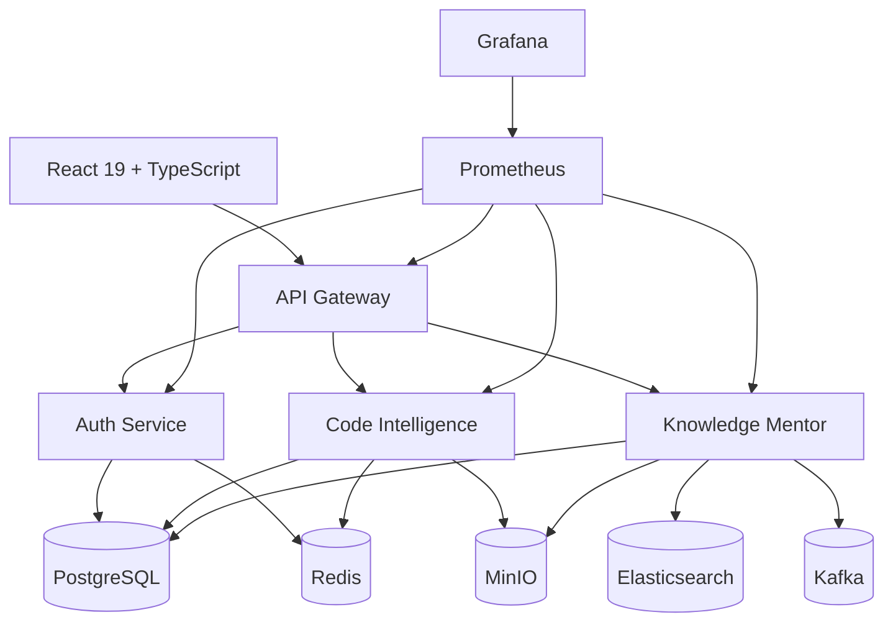

# Think Platform

Think Platform 是一个面向求职展示和工程实践的多智能体代码审查与知识库问答平台。系统由 API Gateway、认证服务、代码智能服务、知识库服务和基础设施组件组成，覆盖代码审查、项目分析、学习路径、文档检索和 RAG 问答等场景。

## 功能概览

- 多 Agent 代码审查：代码规范、架构、安全和性能维度的综合分析。
- 项目管理：支持项目上传、文件扫描、审查历史和质量报告。
- 个性化学习：技能评估、学习路径、练习生成和成就记录。
- 知识库问答：文档上传、BM25 + 向量混合检索、RAG 问答和来源引用。
- 工程化支撑：Spring Boot 微服务、Gateway 鉴权、Prometheus 监控、Docker Compose 本地环境和 GitHub Actions CI。

## 技术栈

### 后端

- Spring Boot 3.2 + Spring Cloud Gateway
- Spring Security + JWT
- PostgreSQL 15.7
- Redis 7.2
- Elasticsearch 8.11
- Kafka 7.5
- MinIO
- Prometheus + Grafana
- 阿里云通义千问 API

### 前端

- React 19 + TypeScript 6
- Vite 5
- Tailwind CSS 3.4
- Redux Toolkit
- React Router 7
- Axios

## 系统架构



## 快速开始

### 1. 环境要求

- JDK 17+
- Maven 3.8+
- Node.js 20+
- Docker 和 Docker Compose

### 2. 配置环境变量

```bash
cp .env.example .env
```

请至少设置以下变量：

- `JWT_SECRET`
- `QWEN_API_KEY`
- `POSTGRES_PASSWORD`
- `ES_PASSWORD`
- `MINIO_ROOT_PASSWORD`
- `GRAFANA_ADMIN_PASSWORD`

### 3. 启动本地依赖和服务

```bash
docker compose up -d
```

### 4. 启动前端

```bash
cd frontend
npm install
npm run dev
```

访问 `http://localhost:5173`。

## Docker Compose 文件

| 文件 | 用途 |
| --- | --- |
| `docker-compose.yml` | 默认本地开发环境，包含基础设施、微服务、Prometheus 和 Grafana |
| `docker-compose.minimal.yml` | 8G 资源档位配置，由原 `docker-compose.8g.yml` 整理后保留为唯一轻量变体 |

## 本地开发命令

```bash
# 后端全量验证
cd backend
mvn verify

# 前端检查和构建
cd frontend
npm run lint
npm run build
```

## 监控

- Prometheus: `http://localhost:9090`
- Grafana: `http://localhost:3000`
- Gateway health: `http://localhost:8082/actuator/health`

Prometheus 抓取目标与 Docker Compose 服务名保持一致：

- `api-gateway:8082`
- `auth-api:8083`
- `knowledge-mentor-api:8080`
- `code-intelligence-api:8081`

## 安全说明

- 不要提交真实 `.env` 文件或任何生产密钥。
- `JWT_SECRET` 不再提供硬编码默认值，必须通过环境变量注入。
- Elasticsearch 已启用基础认证，默认用户名为 `elastic`，密码来自 `ES_PASSWORD`。
- Knowledge Mentor 的 `/documents/**` 和 `/search/**` 默认需要通过 Gateway 鉴权；如需本地临时绕过，可只在本地配置 `app.auth.bypass-patterns`。
- Swagger/Knife4j 在生产配置中默认关闭。

## 许可证

MIT License
